# swagger2apis 2.0
这是一个可以把后端的swagger文档快速转换成api定义文件的插件，减少低级的重复劳动摧残我们的身心，让你的精力专注于你真正应该关注的部分。即使你在看到这个工具时,你的项目已经运作了好一段时间,你依然可以立即在你的项目中使用它,它不会产生任何副作用,它只会在往后的日子里减轻你的工作压力。

你需要的是接受它,并使用它。😁

特性：
- 自动生成`ts`，`ts类型定义`文件，可通过内置插件编译为js

- 支持自定义模板,后期会实现在线即时预览编译结果

- 支持一个插件系统，让你更容易实现自己的特定需求；内部已经实现一些常见的插件，基本让你做到开箱即用

## TDOO

- [x] 重构1.0所有功能(已完成)
- [x] 实现插件系统
- [x] 兼容1.0生成的内容,预计这部分内容会通过插件来兼容
- [x] 完善增强小功能
- [x] 完善更多的边缘case
- [ ] 实现模板编辑即时预览页面
- [ ] 或许应该为插件定义一些元数据内容,比如优先级等


## ２.０使用说明
1.x来讲是一个毫无设计的版本，只是源于自己的一个想法,虽然东拼西凑，但是它依然实现了自己的一部分价值（笑）；相较于1.x来说，2.x来讲我们做出了一些变化，让它看起来稍微像了那么回事~。在2.x中我们将数据源的获取行为交给了你自己，此工具只关心数据的处理，这样你可以更方便的将打包好的数据发送给这个插件；使用方式也得到了更新，所有配置项都替换成了插件的插拔，这样说可能有点迷糊，不过没关系，下边很快会用示例让你明白。

###　安装
```shell
# 强烈建议使用蚂蚁大佬的ni,因为可以无视包管理器差异
npm i @antfu/ni -g
# 然后
ni swagger2apis -D
```
###　使用
在你项目中任何地方新建一个js脚本，内容可以是下边这样的。可以看到，我们没有任何配置项，下面的脚本内容我会尽可能的把所有内置插件都用上,借此机会来说明插件的作用.

```js
import fs from 'fs'
import axios from 'axios'
import {
  create,
  readFileAsString,
  getCurrentDirName
  // ---插件---
  // 会在api的描述中加入入参出参的标注
  ApiTypeInDescription,
  // 1.x版本的方法名兼容插件，如果你的项目是新项目，强烈建议禁用该插件，因为新的命名方式避免了一些问题
  CompatibleApiFnNameOnOldversionHandle,
  // 在文件头部插入警告信息
  FileHeaderAppendWarning,
  // 模块化文件渲染器
  createApiFileModularRender,
  // 代码自动格式化
  createCodeFormatterPlugin,
  // 编译ts > js
  createCompileTS2JSPlugin,
  // 移除api公共前缀
  createPrefixRemovePlugin,

} from 'swagger2apis'
import { join } from 'path'

// 删除ts文件插件
const DeleteTsFilePlugin = {
  afterWriteFile: async (ctx) => {
    const { writedFileList } = ctx
    // 过滤出ts文件
    const tsFileList = writedFileList.filter((item) => item.endsWith('.ts') && !item.endsWith('.d.ts'))
    // 然后删除掉
    tsFileList.forEach((file) => {
      fs.unlinkSync(file)
    })
    return ctx
  }
}

;(async () => {
  // 使用项目的格式化风格来格式代码
  const prettierConfig = JSON.parse(
    await readFileAsString(join(getCurrentDirName(import.meta.url), '../../.prettierrc'), {
      encoding: 'utf8'
    })
  )
  const res = await axios.get('xxxx')
  const app = create(res.data)
  app.usePlugin(createPrefixRemovePlugin('/api'))
  app.usePlugin(ApiTypeInDescription)
  app.usePlugin(CompatibleApiFnNameOnOldversionHandle)
  app.usePlugin(FileHeaderAppendWarning)
  app.usePlugin(createCodeFormatterPlugin(prettierConfig))
  app.usePlugin(createCompileTS2JSPlugin({}, prettierConfig))
  app.cutstomRender(createApiFileModularRender('modules'))
  app.usePlugin(DeleteTsFilePlugin)
  // 只有调用start，齿轮才会开始真正的转动
  app.start()
})()
```
然后使用node环境来执行它,最终他会在你项目中生成一些文件.

目前生成的api定义文件会定位到你执行脚本的相对位置下(建议在执行脚本前，保持你的git工作空间是干净的，这样你能清楚的看到生成了哪些文件，也更易容处理一些特殊情况【指万一万一万一插件生成了错误的内容 =。=】)，你会得到一个`ApisCreator`文件,它的内容应该是下边这样的(如果你没有设置模块渲染器)：

```js
export default (request) => {
  return {
    apiFn1(xxx){xxx},
    apiFn1(xxx){xxx},
    ...
  }
}
```
这个默认到处函数需要你传递一个请求函数进去(目前模板使用的axios风格的请求函数,你可以考虑使用自己的模板,相信这些对于你来说,真的是小case)，会返回一个包含了swagger文档中所有请求路径的对象.所以你还需要定义一个装饰`ApisCreator`的文件(如果可以，你后续应该考虑使用插件来自动生成它，所以在文档后半部分看完插件的开发描述后，你可以回过头来实现一下这个插件，真的，相信我，它很easy)，用它来传入请求函数，以及导出该对象到外部以供使用，下边是一个示例（仅供参考，您可以自由发挥想象）：
```js
import requestFn from './xxx'
import getApis from './ApisCreator'
export default getApis(requestFn)
```
这样你在项目中其他地方自由使用该对象了，他身上包含了文档中所有的请求方法,如果到这一步,你发现已经满足了你的需求,那么你现在就可以立即关闭这个网页,不用往下看了。但是如果发现生成的内容和你预期有一些出入,那么你应该花几分钟来阅读进一步展开的内容。

## 如何开发属于自己的插件？插件系统简述
没有实现你的最终需求?或许你需要使用插件来完成这些工作。该工具实现了一个mini的插件系统,以便于实现你的特殊需求。

请容我先用一个流程图来说明这个工具整个运作流程(不涉及自定义插件的影响下)：

```mermaid
graph LR
    A[调用插件的`create`方法获取实例] --> B[使用实例来预先设置插件等信息]
    B --> C[调用实例的`start`方法]
    C --> D[转换层开始工作,它负责将传递进来的数据进行粗加工]
    D --> E[渲染层开始工作,它在接到数据后将其整理成模板文件需要的形状,以避免在模板里写过多的逻辑;渲染层会将所有需要生成的内容组织成一个文件列表]
    E --> F[写入层开始工作,将所有文件列表写入,完成整个流程]
```

我们清楚了这个流程更容易让我么理解插件的运行机制,我们的插件其实无非就是在这些声明周期之间插入我们自己的逻辑,所以我们理所当然的想到,我们的插件也应该会有生命周期的存在,是的:
```ts
export interface IPlugin {
  // 数据集进行转换前
  beforeTransform?: (context: IContext) => Promise<IContext> | IContext;
  // 数据集进行转换后
  afterTransform?: (context: IContext) => Promise<IContext> | IContext;
  // 数据进行渲染前
  befofeRender?: (context: IContext) => Promise<IContext> | IContext;
  // 数据进行渲染后
  afterRender?: (context: IContext) => Promise<IContext> | IContext;
  // 文件写入前
  beforeWriteFile?: (context: IContext) => Promise<IContext> | IContext;
  // 文件写入后
  afterWriteFile?: (context: IContext) => Promise<IContext> | IContext;
}
```
一个插件至少有一个或者更多的生命周期钩子才能称得上是一个插件.我们可以分别在关键节点使用插件的钩子来插入我们自己的逻辑,来干预最终的运行结果.你可能会好奇,为什么需要`xxxafter`和`xxxbefore`,难道不可以在关键节点之间放置一个钩子隔离即可吗?这样确实可以,但是我们还是细分了钩子,这样是为了在未来更好的让我们的逻辑放置到更清晰的层级.

在上边的示例代码中我们其实已经实现了一个插件,它的作用是在我们将ts编译为js后,删除掉原先ts的功能:
```js
// 删除ts文件插件
const DeleteTsFilePlugin = {
  afterWriteFile: async (ctx) => {
    const { writedFileList } = ctx
    // 过滤出ts文件
    const tsFileList = writedFileList.filter((item) => item.endsWith('.ts') && !item.endsWith('.d.ts'))
    // 然后删除掉
    tsFileList.forEach((file) => {
      fs.unlinkSync(file)
    })
    return ctx
  }
}
```
它使用了`afterWriteFile`钩子来完成了工作,并从`ctx`参数拿到关键数据完成了后续的工作.这个ctx你可以理解为全局上下文,插件每一个插件的生命周期都会接收到它,它是这样一个接口形状:
``` ts
export interface IContext {
  // 传递进来的原始数据
  rawJSON: any;
  // 目前加载的插件集,所以你甚至可以使用插件来操作插件
  plugins: IPlugins;
  // 配置,目前只有一个`outDir`属性可供用户配置,后期可能会考虑删除该属性,完全使用插件来工作
  config: Config;
  // 设置渲染层函数.是的,你可以直接使用自己的渲染器来接管整个渲染工作,当你使用和本项目默认模板差异巨大的时候会很有用;当然你也可以使用它来完成一些其它需求,本项目使用它来完成了文件的模块化功能
  setRender: (renderFn: RednerFn) => void;
  // 转换层处理后的数据
  transformEdJson: any;
  // 渲染层处理后,待渲染数据
  renderData: any;
  // 结合模板形成最终渲染结果,其实描述为待写入项数据更贴切
  renderRes: any[];
  // 写入的文件path列表
  writedFileList: string[];
}
```
这样我们就很清楚的了解了插件的运行流程了,总结就是一个插件可以有多个生命周期钩子,他们会在关键节点插入我们自己的逻辑来完成需求.

### 值得一提的细节
插件的装载和逻辑执行是分开进行的,可以理解为在我们真正调用`start`之前,插件都只存在装载行为,装载过程会将所有插件的生命周期钩子函数聚合,比如我们有两个插件都定义了`befofeRender`钩子,那么在这个声明周期节点,会以异步管道函数来执行这两个钩子形成的生命周期函数的数组,所以这也是我们为什么需要插件入参和出参都是`ctx`的原因,另外不需要你的插件生命周期钩子都是异步钩子,即使是同步钩子也没关系,并没有强制你必须是异步钩子.

### 回头
到这里你已经可以自己来实现一个插件了,所以,现在你可以回头实现一开始我们讨论到的装饰`ApisCreator`文件的插件吗?它应该使用哪个钩子来完成工作呢?

好的,这个插件的伪代码或许应该是下边这个样子:
```js
const CreateApiEntry = {
  xxx: (ctx) => {
    const content = ``
    fs.write(...)
    return ctx
  }
}
```
所以其实就这个需求来讲,我们使用任何一个钩子都不会影响最后的结果,因为他不和我们的全局上下文`ctx`产生联系,他仅仅是需要一个写入特定内容的过程,换句话说,它需要的仅仅是一次执行机会,哈哈.

### 更加疯狂的想法,😡插件是没有上限的😡

你其实完全没必要被我的设计所约束,既然你能参与到全局上下文的`get`与`set`操作,那么等同于你和本工具是站在同一执行权的的等级的,所以你甚至可以创造出完全平行于本工具的执行流程,创造出两条甚至多条互不干扰的逻辑.那你说这样还为啥还要使用这玩意,岂不是等同与所有工作都还是自己来?其实不是,你可以更方便的基于这个工具生成的数据产生新的数据,我的意思是你可以在任意阶段利用插件插入逻辑来基于当前的全局上下文生产出属于自己的数据并挂载到全局上下文,然后在后续阶段继续使用插件的生命周期钩子来消费你产生的这部分自定义数据,这样就使用插件实现了完全平行的执行流程,插件逻辑是没有限制与上限的,所以你可以真正放飞自我的发挥😀.crazy~

我的评价是,如果没有逆天的需求,基本没啥毛用,但是这至少让你明白了插件真的没有上限,你甚至也可以用插件来完全破坏整个流程.😈😈😈

## 关于如何使用自己的模板
关于本项目使用的模板引擎,目前使用版本:3.1.1(几乎没有学习成本,模板引擎都大同小异):
https://www.npmjs.com/package/eta

默认项目模板位置(安装该包后,你可以将其复制出来继续自己的加工):`\node_modules\swagger2apis\dist\template`,
然后就是实现并设置自己的渲染器
```js
import { Eta } from "eta";
const MyRender = async (ctx) => {
  const { renderData } = ctx;
  const eta = new Eta({
    views: '你的模板文件夹路径'
  });
  return [
    {
      content: eta.render("./apis", renderData),
      extName: "ts",
      fileName: ENTRY_FILE_NAME
    },
    {
      content: eta.render("./interfaces", renderData),
      extName: "d.ts",
      fileName: "interfaces"
    }
  ];
};
app.cutstomRender(MyRender)
```
这样你就可以为所欲为的生成任意内容了~

## 最后

这几乎就是这个小工具的全部内容了,祝 玩的开心~
